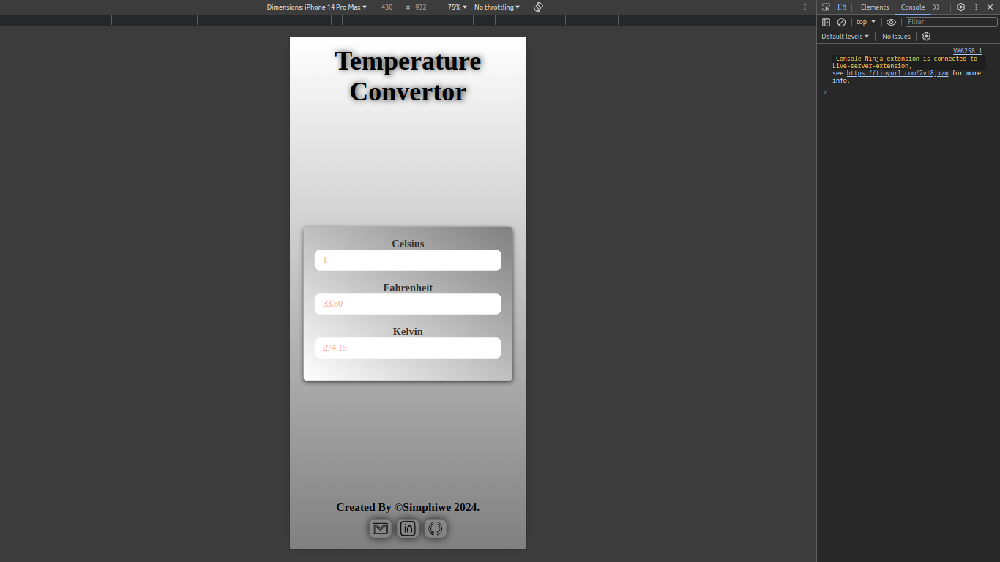
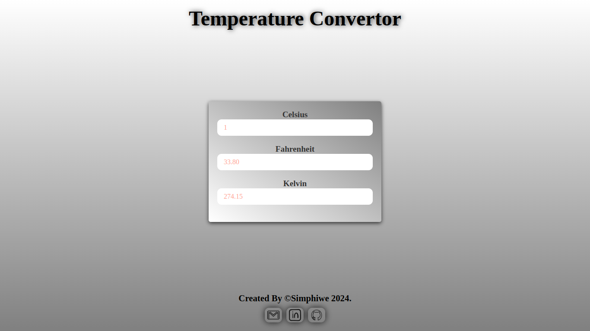

# Temperature Convertor

Check it _**LIVE**_ 👉
**<https://deebest.github.io/temperature-convertor/>**

A _**Temperature Convertor**_ web application I built with HTML,CSS and JavaScript, I built it as a part of my JavaScript learning journey.

## Uses

- You can convert **CELSIUS**, **FAHRENHEIT** & **KELVIN** same time dynamically _!!_

## Tech Stack Used

- GIT
- HTML
- CSS
- JavaScript

## Get In Touch 👇

Email : **<simphiwedladla8@gmail.com>**

Linked: **<https://www.linkedin.com/in/dladla-simphiwe-89061a20a/>**

Github: **<https://github.com/DeeBest>**

Portfolio: **<https://deebest.github.io/personal-webpage/>**
